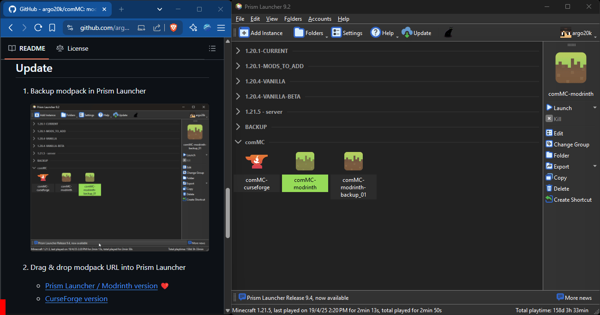

[![Issues][issues-shield]][issues-url]
[![Feature Requests][features-shield]][features-url]
[![project_license][license-shield]][license-url]

<!-- PROJECT LOGO -->
 

  

<h3 align="center">comMC</h3>

  

    Our community Minecraft server
     
    <a href="https://github.com/argo20k/comMC"><strong>Explore the docs »</strong></a>
     
     
    <a href="https://github.com/argo20k/comMC/issues/new?labels=bug&template=bug-report---.md">Report Bug</a>
    &middot;
    <a href="https://github.com/argo20k/comMC/issues/new?labels=enhancement&template=feature-request---.md">Request Feature</a>
  

<!-- TABLE OF CONTENTS -->

  
Table of Contents

  <ol>
    <li><a href="#install-1st-time">Install (1st Time)</a></li>
    <li><a href="#update">Update</a></li>
    <li><a href="#roadmap">Roadmap</a></li>
  </ol>

<!-- INSTALLATION -->
## Install (1st Time)

1. Install Prism Launcher
    - [Prism Launcher](https://prismlauncher.org/download/windows/) ❤️ (recommended)
    - [Modrinth App](https://modrinth.com/app)
    - [CurseForge App](https://www.curseforge.com/download/app)
2. Drag & drop modpack URL into Prism Launcher
    - [Prism Launcher / Modrinth version (.mrpack)](<https://github.com/argo20k/comMC/releases/download/1.7.5/comMC-modrinth.mrpack>) ❤️
    - [CurseForge version (.zip)](<https://github.com/argo20k/comMC/releases/download/1.7.5/comMC-curseforge.zip>)
3. Launch the Game & Join the Server
4. Go to `#general` in Discord & run `/verify <your-code>` to whitelist your account
> 🎉 That’s it! You only need to do this set up once. 
Next time, just follow the [Update](#update) steps below.

<!-- UPDATE -->
## Update

1. Backup modpack in Prism Launcher

    
2. Drag & drop modpack URL into Prism Launcher  

    
    
    - [Prism Launcher / Modrinth version](<https://github.com/argo20k/comMC/releases/download/1.7.5/comMC-modrinth.mrpack>) ❤️
    - [CurseForge version](<https://github.com/argo20k/comMC/releases/download/1.7.5/comMC-curseforge.zip>)
  
<!-- ROADMAP -->
## Roadmap

- [x] Add [Changelog](./CHANGELOG.md)
- [x] Add [Roadmap](https://github.com/argo20k/comMC?tab=readme-ov-file#roadmap)
- [ ] Add Member Requested Mods
- [ ] Plan comMC Season 2
    - [ ] Events & Mods

[Open issues](https://github.com/argo20k/comMC/issues/new?labels=enhancement&template=feature-request---.md) to propose features you'd like to see added to comMC! or just join the Discord

(<a href="#readme-top">back to top</a>)

<!-- MARKDOWN LINKS & IMAGES -->
<!-- https://www.markdownguide.org/basic-syntax/#reference-style-links -->
[issues-shield]: https://img.shields.io/github/issues/argo20k/comMC.svg?style=for-the-badge
[issues-url]: https://github.com/argo20k/comMC/issues
[features-shield]: https://img.shields.io/badge/-Features-black.svg?style=for-the-badge&logo=linkedin&colorB=555
[features-url]: https://github.com/argo20k/comMC/issues?q=label%3Aenhancement
[license-shield]: https://img.shields.io/github/license/argo20k/comMC.svg?style=for-the-badge
[license-url]: https://github.com/argo20k/comMC/blob/main/LICENSE